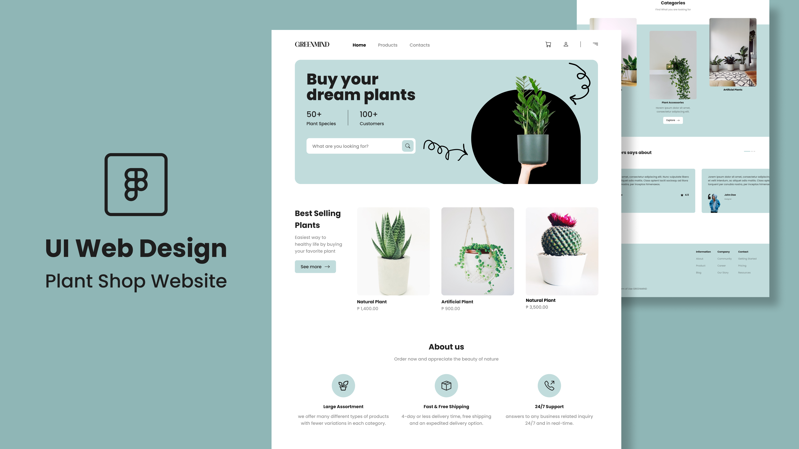

# Plant Shop Website 🌿

Welcome to **Plant Shop Website**, a modern and interactive landing page developed with **React**, using **Framer Motion**, **Tailwind CSS**, and **TypeScript** for a smooth and stylish experience.



## 📌 Technologies Used

| Technology      | Description                                           | Icon |
|---------------|------------------------------------------------|--------|
| **React.js**  | Library for building dynamic interfaces         |  |
| **TypeScript**| Superset of JavaScript with static typing      |  |
| **Tailwind CSS** | Utility-first CSS framework for fast styling |  |
| **Framer Motion** | Animation library for React                 |  |

## 🚀 Features
- **Responsive Design** 📱💻
- **Smooth Animations** with Framer Motion 🎬
- **Modern and Intuitive UI** 🎨
- **Modular and Scalable Code** 🏗️

## 📂 Project Structure
```
plant-shop-website/
├── src/
│   ├── components/   # Reusable components
│   ├── pages/        # Main pages
│   ├── assets/       # Images and icons
│   ├── styles/       # Tailwind CSS styles
│   ├── App.tsx       # Main component
│   └── index.tsx     # Entry point
├── public/           # Static files
├── package.json      # Dependencies and scripts
└── README.md         # Documentation
```

## 📦 How to Run the Project

1. Clone this repository:
   ```sh
   git clone https://github.com/your-username/plant-shop-website.git
   ```
2. Navigate to the project folder:
   ```sh
   cd plant-shop-website
   ```
3. Install dependencies:
   ```sh
   npm install
   ```
4. Start the development server:
   ```sh
   npm run dev
   ```
5. Open in your browser:
   ```
http://localhost:3000```

## 📄 License
This project is licensed under the MIT License. Feel free to contribute and customize! 🚀

